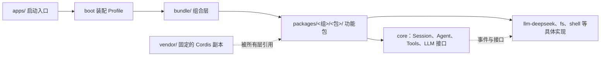

# 仓库地图

DSH 是一个 monorepo，也就是许多相互协作的包放在一个仓库里；目录名表示代码承担的层次。先把整张地图看一眼，再往下读：

读法：箭头指依赖方向；虚线是“所有人都可以引用的基础”。`apps` 只负责启动，业务能力都在 `packages` 里；换一个具体实现（例如换模型提供方）时，接口层保持不动。

## 顶层目录

展开顶层目录（10 行）

| 目录 | 用简单的话说 | 读它时关注什么 |
|---|---|---|
| `vendor/` | 固定放进仓库、由 DSH 自己维护的第三方基础库副本 | 先读 `vendor/README.md` 的 Manifest 和 Local modifications；它们有 DSH 的重命名、构建配置和部分行为修改，不要把第三方设计或 DSH 修改混为一谈 |
| `packages/` | DSH 的主要功能包 | 看包 README、入口、Service Definition、Provider、Consumer 和测试 |
| `apps/` | 可以启动的 CLI 和 Web 应用 | 看它怎样把参数、环境和包组装起来 |
| `examples/` | 适合运行和学习的示例 | 看最小组合和真实启动方式 |
| `docs/` | 官方架构、开发、用户和子系统文档 | 这里是上游文档的权威解释，不是本仓库新增的逐文件索引 |
| `scripts/` | 构建、生成、检查和发布脚本 | 看哪些规则由机器重复验证 |
| `native/` | 操作系统、沙箱和原生能力 | 看跨平台边界以及失败时怎样回退 |
| `python/` | Python SDK 和运行支持 | 看进程外调用与 Python 世界如何接入 |
| `website/` | 文档网站相关代码 | 看文档怎样被发布，不要和 agent 运行时混在一起 |
| `.agents/` | 给 agent 和贡献者的规则、技能、笔记 | 它指导如何修改仓库，但不是产品运行入口 |

上面的探索器把这张表变成可点选的：选一个目录，右侧给出表格里的两栏原文，并标出它在不在运行时依赖主链上；左侧的链图复刻本课开头的 mermaid，选中 `apps/`、`packages/`、`vendor/` 时对应节点会高亮。

## `packages` 里面怎样找

包按功能组放在 `packages/<组>/<包>/`。例如：

- `packages/core/session` 负责会话事件日志和内存中的会话。
- `packages/core/agent` 定义 Agent 能力和 agent 事件。
- `packages/core/agent-loop` 提供默认的轮次驱动器。
- `packages/core/tools` 管理工具注册、schema、审批、执行和结果。
- `packages/llm/llm` 定义模型消息和流式接口。
- `packages/llm/llm-deepseek` 把 DeepSeek HTTP/SSE 协议接到通用 LLM 接口。
- `packages/boot/app-boot` 负责 profile、bundle 和补丁层的启动组合。
- `packages/bundle/base`、`headless`、`web-app` 把许多包装成可运行的 profile 层。

一个普通包常见的结构是：`README.md` 说明契约，`src/index.ts` 作为公开入口，其他 `src/*.ts` 承担细分职责，`tests/` 验证行为，`package.json` 声明依赖和构建入口。不是每个包都完全相同，先按这个模式寻找即可。

## 依赖方向

依赖方向从抽象指向具体：核心包提供接口和事件，具体包提供本地、远程或第三方实现，Bundle 决定怎样组合，Apps 负责启动。一个可以验证的例子：`packages/core/tools` 不 import 任何一个文件系统后端，工具通过 `ctx.fs` 取能力（`ctx.fs` 的声明在 `packages/fs/fs`），所以换本地磁盘、远程沙箱或测试 fake 时，工具本身不用重写。

## 为什么不把所有代码写在一个目录

DSH 需要同时支持 Web、headless、CLI、插件和测试。拆开的直接好处在本仓库就能看到：同一个 Agent Loop 被 web-app Bundle 和 headless Bundle 各自挂载（见[核心文件精读](03-核心文件精读.md)的两个 Bundle 条目），两份 Profile 复用同一份循环实现；把测试、示例和 vendor 分开，则能看出哪些是产品逻辑、哪些是教学材料、哪些是外部依赖。

## 继续往下读

先看[官方架构文档](../docs/architecture.md)，再看[Cordis 与插件树](02-Cordis与插件树.md)。如果你想找某个具体文件，打开[逐文件索引的读法](08-逐文件索引怎么读.md)并按目录跳到对应索引页。
