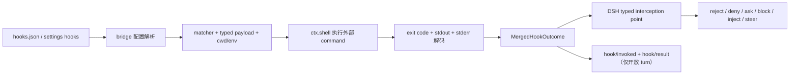

# 官方 HookBridge 与兼容层

> 证据范围：本文解释上游 `deepseek-ai/deepseek-harness` 固定提交 [`aa6c361a972c8369148dea7380bb5c21c24e07ec`][fixed-tree]（`0.1.1-rc.2`）中的 `hook-protocol`、Claude Code bridge、Codex bridge、对应 README、Agent Note 和测试源码。人工对照完成于 2026-08-16（Asia/Shanghai）的上一个固定基线；迁移到当前基线后只验证了链接路径仍存在，没有逐行复读版本差异。

> 证据状态：下面写“测试证据”时，意思是静态阅读了固定提交中的测试断言和测试名称；本次没有运行上游测试，没有启动 DSH 或任何 `Test-DSH*`，也没有做真实 shell hook、模型、Profile 或 state 验证。

> 术语边界：固定提交把 `hooks-claude-code` 和 `hooks-codex` 做成 Cordis 的插件形态，但本文称它们为“上游 bridge 包”或“兼容层”，不把 bridge 宣传成 marketplace 意义上的“官方插件”；外部 `hooks.json`、shell 脚本和社区项目也不因此获得官方身份。

bridge 的裁决最终落在 DSH 的瀑布事件上，而瀑布事件有一条仓库级不变式：监听器要么调用 `next()` 把控制权交还链条，要么直接返回一个终端决定；不调用 `next()` 就返回，链条在这一环短路，后面的监听器不再执行。下面的组件把这条规则做成可以亲手触发的实验——审计、策略、默认放行三个监听器挂在同一次派发上，切换策略的返回方式，看兜底还会不会执行、最终结果由谁写出。

<LessonWidget
  id="hook-flow-lab"
  url="/hook-flow-lab.html"
  title="Hook 瀑布短路实验"
  :height="880"
  fallback-href="#六四种扩展方式怎么选"
>

时间线是固定教学模型：三个监听器、两条规则（委托或短路）、一份确定性步骤表。它不加载真实 bridge，不执行外部命令，也不测量协议超时；真实 bridge 对 `undefined` 返回的处理以源码和测试为准。不打开组件也能继续读正文——下面的合并规则与退出码解码表给出同样的结论。

</LessonWidget>

## 一、先把四个词分开

初学者可以先把一次 hook 运行想成一次跨进程翻译：外部程序只知道“读一段 JSON、执行命令、写 stdout/stderr、返回退出码”，而 DSH 内部需要的是带类型的事件监听器和带类型的决策对象。

| 名称 | 它面对的世界 | 它真正做的事 |
|---|---|---|
| 外部 shell hook | Claude Code 或 Codex 的 `hooks.json` 与命令进程 | 从 stdin 读取 JSON，根据自己的规则输出 JSON/文本，靠退出码表达成功或阻断 |
| `dsh-hook-protocol` | 两种外部协议都共有的部分 | 提供 matcher、stdin/环境传递、退出码和 stdout 解码、多个 hook 合并、`hook/*` 日志以及 detached 运行跟踪；它本身“不注册、不注入”，不是 Cordis 插件[protocol README][protocol-readme] |
| Hook bridge | 外部协议与 DSH 之间的适配层 | 读取配置、选择匹配器、构造某个方言的 payload、调用 shell、把中性结果映射成 DSH typed Decision |
| DSH typed interception point | DSH 内部的公开扩展面 | 例如 `agent/pre-step`、`tools/pre-execute`、`tools/post-execute` 和 `agent/turn-stopping`，监听器通过类型化的 `PreStepDecision`、`PreToolDecision` 或 `PostToolDecision` 参与流程[interception note][interception-note] |

最重要的设计判断是：bridge 不是一套新的 DSH 权限模型，也不是把任意字符串“塞进” agent loop；
它只能把外部协议中已经被映射的子集送到 DSH 已经定义好的 typed point。
上游 Agent Note 明确说，原生 hook 其实只是订阅这些 canonical lifecycle event 的普通 Cordis 插件；
bridge 的价值是兼容已有的外部 shell hook，而不是提供比原生插件更强的能力[hook bridges note][bridge-note]。

## 二、共享协议层：命令怎样变成中性结果

### 1. 配置和 matcher

两种配置都采用“事件名 → matcher group → hooks 数组”的结构。一个 group 可以没有 matcher；缺失、空字符串和 `*` 都表示匹配全部。解析器只保留自己支持的事件，坏的 group 或缺少 command 的条目会被丢弃，非 command 条目会被记录为 skipped 并告警。

| 方言 | matcher 规则 | matcher 查询值 | 没有匹配主体的事件 |
|---|---|---|---|
| Claude Code | 只含字母、数字、下划线和 `\|` 的模式（`[A-Za-z0-9_\|]+`）按字面量处理：先按 `\|` 拆成备选项，再与查询值做整串精确比较，`Bash\|Read` 只匹配 `Bash` 或 `Read`；含其他字符的模式按不自动加锚点的正则解释 | `PreToolUse`/`PostToolUse` 用工具名；`SessionStart` 用 session source；`SubagentStart`/`SubagentStop` 用固定的 `general-purpose` | `UserPromptSubmit` 和 `Stop` 的 matcher 在解析时被丢弃 |
| Codex | 所有非空模式都是不自动加锚点的正则，没有 Claude Code 的字面量快捷规则 | `PreToolUse`/`PostToolUse` 用真实工具名；`SessionStart` 用 session source | `UserPromptSubmit` 和 `Stop` 的 matcher 在解析时被丢弃 |

例如 Claude Code 的 `Bash` 只精确匹配 `Bash`，不会匹配 `BashOutput`；
Codex 的 `Bash` 是 `/Bash/`，会匹配包含 `Bash` 的工具名。
固定提交的 matcher 测试同时检查了这两个容易混淆的差异，并检查了非法正则在运行时不会向 agent loop 抛异常，而配置解析阶段会给出稳定诊断[matcher source][protocol-matcher] [matcher tests][matcher-tests]。

matcher 有两个时机：`matcherDiagnostic()` 在 bridge 注册前检查被消费的配置，非法正则会使本次配置加载失败并注册零个 hook；
`matchesMatcher()` 在运行时把非法模式当成“不匹配”。
因此 `UserPromptSubmit` 上写了非法 matcher 不会影响它，因为该事件本来就没有 matcher subject；
在 `PreToolUse` 上写非法 matcher 则会被报告。
这个行为由两套 config 测试分别覆盖[Claude config tests][claude-config-tests] [Codex config tests][codex-config-tests]。

### 2. stdin、环境、工作目录和超时

共享 `runHook()` 要求调用方显式传入 `AbortSignal`，把 payload 序列化为 JSON 写入 stdin，把每个 hook 的 `timeoutSec` 从秒转换成毫秒；
没有 per-hook timeout 时使用 bridge 配置的默认值，参考默认是 `600_000 ms`，也就是十分钟。
它通过 `ctx.shell` 的 `ShellExecutor` 执行，源码注释和测试说明该路径复用凭据清理、进程组取消和等待机制；
执行器基础设施失败时返回 `exitCode: undefined` 的非阻断结果，而不是把 agent loop 弄崩[runner source][protocol-runner] [runner tests][runner-tests]。

两个 bridge 都把 agent-scoped hook 的工作目录设为 session header 的 `cwd`，所以相对路径指向用户项目目录，而不是 DSH 进程的启动目录。
Claude Code 还会把 `CLAUDE_PROJECT_DIR` 放入 hook 环境：显式 `projectDir` 优先，否则默认使用相同的 session workspace，并在配置解析时替换 `${CLAUDE_PLUGIN_ROOT}` 和 `${CLAUDE_PROJECT_DIR}`。
Codex bridge 不做这两类 placeholder substitution，也不额外注入 Codex 专属环境变量；
它仍然使用 `ctx.shell` 提供的执行环境[Claude source][claude-index] [Codex source][codex-index]。

stdin 的末尾换行是一个真实的 wire-level 差异：Claude Code bridge 传 `trailingNewline: true`，Codex bridge 传 `false`。固定提交的 runner 测试分别断言有换行和无换行，不能把两个 bridge 简化成“都执行同一个 JSON command”[runner tests][runner-tests]。

### 3. 退出码和 stdout/stderr 字段

共享 codec 先保留 trim 后的 stdout 和 stderr，再按退出码解码：

| 外部命令结果 | `HookOutput` 的含义 | bridge 后续通常怎样用 |
|---|---|---|
| `exit 0` | 成功；stdout 若以 `{` 开头则尝试解析 JSON，格式不对时仍保留为普通 stdout | Claude Code 在有些事件只消费结构化字段；Codex 的 `SessionStart`/`UserPromptSubmit` 还可把干净的普通 stdout 当作 `additionalContext` |
| `exit 2` | `decision: 'block'`；stderr 成为阻断理由，空 stderr 仍然阻断但没有理由 | 映射成 prompt reject、tool deny/block 或 Stop steering |
| 其他非零退出码 | 非阻断错误；exit code 和 stderr 可记录，但没有阻断 decision | 当前桥接不会仅因为 `exit 1`/`127` 就拒绝工具 |
| 进程无法运行或被信号终止 | `exitCode` 为 `undefined`；错误放在 stderr，仍是非阻断错误 | 写入结果证据（若有开放 turn），不把基础设施错误伪装成 hook deny |

结构化 stdout 的字段分成两个频道。
顶层 `decision` 只接受 `approve` 或 `block`；
`allow`、`deny`、`ask` 只能来自 `hookSpecificOutput.permissionDecision`。
后者还可以带 `hookEventName`、`permissionDecisionReason`、`additionalContext` 和 `updatedInput`。
`hookSpecificOutput` 的事件名与当前 firing event 不一致，或者缺少事件名时，codec 只丢弃事件专属字段，仍保留顶层的 `continue`、`stopReason` 等事件无关字段；
这样一个写错事件名的 block 不会意外阻断另一个 point[codec source][protocol-codec]。

`continue: false`、`stopReason` 和 `systemMessage` 会先进入中性 `HookOutput`，多个结果合并时第一个 `continue: false` 会形成 sticky stop，`additionalContext` 与 system message 按 hook 顺序收集，权限结果按 `deny > ask > allow` 合并，
理由只保留最终获胜等级的理由[merge source][protocol-merge] [merge tests][merge-tests]。
但是“被解析”不等于“已实现完整控制”：当前两套 bridge 都会把 `continue: false` 记录为 `stop` 却不真正硬停整个 run；
`systemMessage` 会告警但不展示；
`updatedInput` 会被解析并告警，但不进入可执行的工具参数改写。
这些是兼容子集的边界，不应写成 DSH 已经支持输入重写或全局 halt。

## 三、从外部事件到 DSH typed point

下面的“支持”表示固定提交中 bridge 实际注册了映射，并不表示已经覆盖外部产品全部协议字段。

| 外部事件 | Claude Code bridge | Codex bridge | DSH typed point 与结果 |
|---|---|---|---|
| `SessionStart` | 支持 JSON `additionalContext` | 支持 JSON `additionalContext`，也支持干净的普通 stdout | `agent/session-start` 是 emit/通知点，不能阻断启动；结果准备好后调用 `agent.inject()`。两者都 detached，可能赶不上第一请求 |
| `UserPromptSubmit` | 支持 exit 2/deny 和 JSON `additionalContext`；普通 stdout 不作为 context | 支持 exit 2/block、JSON `additionalContext` 和干净普通 stdout | `agent/pre-step` waterfall；阻断返回 `PreStepDecision.reject`；只有 context 时先 `next()`，再把来源明确的消息加到下游 `enter`，避免短路后面的策略监听器 |
| `PreToolUse` | `deny` → `PreToolDecision.deny`；`ask` → `PreToolDecision.ask` | `block`/`deny` → `PreToolDecision.deny`；不承诺 `allow`/`ask` | `tools/pre-execute` waterfall；没有阻断时必须 `next()`，因此“hook 没说话”不等于自动 allow |
| `PostToolUse` | deny → `PostToolDecision.block` 加反馈；context 单独附加 | 同样 block 加反馈；context 单独附加 | `tools/post-execute` waterfall；bridge 先委托后合并 context，下游 listener 仍可替换或阻断；工具输出被压平成文本，不能假设结构化 tool output 原样保留 |
| `Stop` | 支持阻断 Stop | 支持阻断 Stop | `agent/turn-stopping` 是已等待的停止边界；bridge 用 `agent.steer()` 写入下一步模型可见理由，让当前 turn 继续；当前总是上报 `stop_hook_active: false`，无条件阻断的脚本必须自行限次 |
| `SubagentStart` | 支持；context 只注入存活的本地 in-process child | 不支持，配置解析时丢弃 | `subagent/start` emit/detached；匹配 subject 固定为 `general-purpose`，不能从 DSH seam 得到任意 Claude agent kind |
| `SubagentStop` | 支持，但只能观察，不能阻断或注入 | 不支持，配置解析时丢弃 | `subagent/end` emit/detached；Claude bridge 会保留 child 到配对的 end 边缘，以便 stop hook 仍能用正确 workspace |

这张表里有三个值得记住的类型化规则。
第一，context-only hook 不能直接返回一个新的 `enter`，否则它会截断后来注册的 sandbox/policy listener；
固定提交的 Claude 和 Codex coverage tests 都有“先 delegate，再保留 context”的场景。
第二，`ask` 是 DSH 的审批路径，不是 shell hook 自己授予操作系统权限；
Claude 的 `PreToolUse` ask 需要可用的 approval service/answerer，没有它会 fail closed 为 deny，Codex bridge 没有这条路径。
第三，native plugin 直接返回 typed Decision，不会因为使用 native path 自动产生 `hook/*` 外部协议日志；
`hook/*` 属于 protocol bridge 的审计记录[bridge note][bridge-note] [Claude bridge tests][claude-bridge-tests] [Codex bridge tests][codex-bridge-tests]。

Claude Code README 记录的固定子集是其当前 30 个 hook event 中的 7 个：`SessionStart`、`UserPromptSubmit`、`PreToolUse`、`PostToolUse`、`Stop`、`SubagentStart`、`SubagentStop`；
其余 `Setup`、`PermissionRequest`、`PreCompact` 等事件不会被这个 bridge 注册。
Codex README 记录的是当前 10 个中的 5 个：`PreToolUse`、`PostToolUse`、`SessionStart`、`UserPromptSubmit`、`Stop`；
`PermissionRequest`、`PreCompact`、`PostCompact`、`SubagentStart`、`SubagentStop` 被丢弃[Claude README][claude-readme] [Codex README][codex-readme]。

### 两种 payload 的最小心智模型

Claude Code 的基础字段是 `session_id`、字符串形态的 `transcript_path`、`cwd`、`hook_event_name`；
工具事件再带 `tool_name`、原始的 `tool_input`、`tool_use_id` 和文本化的 `tool_response`，prompt 事件带 `prompt`，Stop 带 `stop_hook_active: false`。
Subagent payload 还带 child 的 `agent_id` 和固定 `agent_type: "general-purpose"`。

Codex 的基础字段是 `session_id`、`transcript_path: string | null`、`cwd`、`hook_event_name`、静态配置的 `model` 和 `permission_mode: "default"`；
turn-scoped 事件带字符串 `turn_id`。
工具 payload 的 `tool_name` 是真实的 DSH tool name，`tool_input` 被有意缩减成 `{ command }`，没有 command 参数时传空字符串；
PostToolUse 的 `tool_response` 是文本。
这个缩减意味着 Codex bridge 不能忠实暴露任意非 shell tool 的全部参数[Codex source][codex-index]。

两个 bridge 注入的 context 都带 `{ kind: 'plugin', plugin: 'hooks-claude-code' | 'hooks-codex' }`，所以 hook 生成的内容不会被误记为用户原话。普通 stdout、JSON `additionalContext` 和错误 stderr 的消费方式由方言决定，不能只看字段名就假定两个 bridge 行为相同。

## 四、detached hook 的 abort 与 drain

“detached”不是“丢到后台然后不管”。它表示 DSH 的 emit-shaped point 不会等待外部命令完成，所以 bridge 必须自己拥有 promise 生命周期，否则插件销毁后，旧 hook 仍可能向已释放的 context 注入内容或写日志。

固定协议库的 `createDetachedRuns()` 为每个 bridge `apply()` 建立一个 `AbortController` 和一个 in-flight Set。
bridge 把“hook 执行 + `.then()` 里的 inject/后续动作 + `.catch()`”作为完整 promise chain 交给 `track()`，并把 tracker 的 signal 传给 `runHook()`。
bridge 的 `ctx.effect()` disposer 调用 `drain()`，因此 Cordis 的 `fiber.dispose()` 只有在 detached 工作真正停稳后才会完成[detached source][protocol-detached]。

可以按下面的时间顺序理解：

1. emit point 到达时，tracker signal 尚未 abort，bridge 启动 `runPoint()` 并立即 `track()` 整条 chain。
2. `runHook()` 把同一个 signal 交给 `ctx.shell`；如果是 turn-scoped point，则 point 自己的 signal 也能在取消时终止正在运行的命令。
3. bridge 被卸载时，`drain()` 先以 `hook bridge disposed` 为原因触发 abort，避免 detached hook 被十分钟默认 timeout 拖住。
4. `ctx.shell` 的取消路径负责进程组 kill/join；tracker 等待整条 chain，而不只是等待子进程返回。
5. 如果第一批 promise 在 drain 过程中又 track 了第二批，`drain()` 会重新观察 Set，直到所有波次都 settle；rejected chain 也不会让 settlement bookkeeping 永久悬挂。

因此，Claude Code 的三个 emit point 是 `SessionStart`、`SubagentStart`、`SubagentStop`，Codex 的 detached point 是 `SessionStart`。
turn-scoped 的 prompt/tool/stop point 则在其 waterfall 或停止边界中 await `runPoint()`，并在开放 turn 内写审计 pair。
固定 detached tests 静态断言 signal 初始未触发、drain 会 abort、drain 会等待当前 promise、会等待 drain 期间追加的 promise，并能处理 rejected run；
两套 bridge tests 还分别有“dispose aborts a still-running hook and drains to quiescence”的场景[detached tests][detached-tests] [Claude lifecycle test][claude-bridge-tests] [Codex lifecycle test][codex-bridge-tests]。

detached 有一个产品语义后果：`SessionStart` 不能阻断启动，context 是“准备好就注入”的 best effort。若 shell hook 较慢，第一份模型请求可能已经发出，后来的 context 只能进入后续请求；固定提交把这项能力标成 `TODO(session-start-gating)`，不能把测试中的快速脚本结果推广成“首请求必达”。

## 五、生命周期、日志与权限边界

### 生命周期和配置

两个 bridge 都只在加载时读取一次 `configPath`；
相对路径相对于进程启动 cwd，而不是每个 `session/new.cwd`。
读取/JSON 解析失败、被消费事件的非法 matcher 或其他加载错误会记录 warning，并注册零个 hook，而不是让整个 agent boot 失败。
Claude 只运行 shell-form `type: "command"`，会跳过 `http`、`mcp_tool`、`prompt`、`agent`；
Codex 只运行同步 command，会跳过非 command 和 `async: true`。
完整的多层 user/project/session/system 配置发现、信任控制和 live reload 都不在此固定子集内。

turn-scoped point 在有开放 turn 时为每次命令写一对 log-only session event：`hook/invoked` 记录 `turn`、point、dialect、matcher、handlerId；
`hook/result` 用相同 handlerId 关联，记录 decision、可选 exitCode、最多 500 字符的 stderrSummary 和 durationMs。
它们不是 `SurfaceEventType`，没有 `surfaceOp`，也不是用户可见消息。
`SessionStart` 在 turn 1 之前运行，因此没有 `hook/*` pair；
这不表示命令没有运行，而是协议要求 hook 日志位于开放 turn 内[events source][protocol-events] [events tests][events-tests]。

### 执行权限不是 hook decision

要区分两种“权限”：

1. `PreToolUse` 返回 `ask`/`deny` 是 DSH 对一次工具调用的 typed policy decision。Claude Code bridge 的 `ask` 进入 DSH approval seam；无 approval service 或 answerer 时 fail closed。Codex bridge 只有 block/deny，没有 allow/ask 的审批映射。
2. 外部 command 本身以 DSH 进程能够使用的 shell 权限运行。bridge 通过 `ctx.shell` 复用宿主的执行、凭据清理、timeout 和取消能力；Claude 还主动传 `CLAUDE_PROJECT_DIR`，而两个 bridge 都把工作目录放到用户 session workspace。bridge 没有凭此把一个不可信脚本变成隔离沙箱，也没有把配置路径的多层 trust/hash 模型补齐；实际是否允许文件、网络或其他 shell 行为，必须看部署给 `ctx.shell` 的策略和操作系统账号。

这也是为什么“某个 hook 返回 allow”不能写成“它取得了系统权限”：在 Claude Code bridge 中 `allow` 不会自动预批准工具，在 Codex bridge 中更不会进入 pre-tool approval path；外部 command 的 OS 权限和 DSH tool 的 policy decision 是两条不同的链。

### 版本边界

本章固定的是根包 `0.1.1-rc.2`、提交 `aa6c361a972c8369148dea7380bb5c21c24e07ec` 的源码；
本地固定版本说明也提醒该项目仍是 Developer Preview，未来允许破坏性变化[固定版本说明](../UPSTREAM.md)。
因此“Claude 7/30、Codex 5/10”是该提交 README 对其外部协议快照的支持子集，不是对未来 Claude Code、Codex 或 DSH 的永久承诺。
协议增加字段、改变 matcher、改变 timeout、改变 config discovery 或新增 typed point 后，都必须重新核对 bridge 源码、README 和测试。

## 六、四种扩展方式怎么选

| 方式 | 入口和能力 | 证据/兼容性 | 适合什么情况 | 主要代价 |
|---|---|---|---|---|
| 公开扩展点上的原生 Cordis 插件 | 在 `apply(ctx)` 中订阅 typed point，直接返回 `PreStepDecision`、`PreToolDecision`、`PostToolDecision`，或调用 `agent.inject()`/`agent.steer()` | 固定 Agent Note 把 native hook 定义为普通 Cordis plugin；没有 shell JSON 序列化，也不自动产生 `hook/*` bridge 日志 | 新写的 DSH 行为、需要完整 `ctx`、需要可靠类型和更细控制的逻辑 | 需要按 DSH API 编写和测试，不能直接复用任意外部 `hooks.json` |
| Hook bridge | 读取现有 Claude Code/Codex command hook，经过 stdin/stdout/退出码协议后映射到少数 typed point | 上游固定提交有两个 bridge README、实现和真实 loop 测试源码；只证明固定提交中的映射子集 | 已有 shell hook 想在 DSH 中继续工作，且能接受字段和生命周期降级 | 序列化边界、方言差异、支持子集、串行执行、process-level config、未实现 hard halt/input rewrite |
| 源码 patch 或维护 fork | 修改 DSH 自己的 loop、事件类型或 bridge/工具实现，可增加真正新的 typed point | 这是 fork 的维护选择，不是固定上游公开扩展点的兼容证明；每次升级都要重放 patch 并补测试 | 必须改变核心语义、需要新的一致性保证，且团队愿意维护 fork | 合并冲突、版本漂移、构建/测试矩阵和长期同步成本都由 fork 维护者承担 |
| 运行时注入 | 触碰 loader 内部对象、模块缓存、Fiber/private Map、目录链接或进程运行时状态 | 固定上游 Hook README、typed interception Note 和 bridge tests 没有把它定义成 hook API；社区项目的自述也不能补足官方兼容证据 | 诊断、实验或无法改源时的临时研究，不宜作为稳定产品扩展面 | 私有实现漂移、卸载/重复注册/缓存残留、权限和供应链风险；很难证明 dispose 后真的 quiescent |

### 社区样本的证据对照（2026-08-16）

本节把“上游 bridge”和社区仓库放在同一张表里，是为了防止读者因它们都能被装入 DSH 而混淆身份。日期是本轮访问时间；“项目自述”不是上游背书，也不是安全或兼容性结论。

| 样本 | 本轮公开证据 | 应归入的层 | 尚未证明的事项 |
|---|---|---|---|
| `@deepseek-ai/dsh-hooks-claude-code`、`@deepseek-ai/dsh-hooks-codex` | 上游固定提交的包 README、源码和测试把它们写成 Cordis bridge plugin；README 分别列出 7 个和 5 个外部事件子集。共享 `dsh-hook-protocol` README 明确写着 library 不注册、不注入。见[上游 bridge README][claude-readme]、[Codex bridge README][codex-readme]、[协议 README][protocol-readme]。 | 上游仓库交付的协议适配器；“官方”仅指事实来源在上游仓库，不能外推为安全认证或未来版本承诺。 | 没有证明未来协议仍保持相同子集，也没有证明外部 hook 获得 OS 沙箱、全局 hard halt 或 input rewrite。 |
| `omdsh-dev/dsh-annotation`、`vlln/dsh-navbar` | 固定 README 自称 `dsh.bundle`/`dsh.client` 或纯浏览器 bundle，分别说明 Node half 为空或 0 patch；它们的 package/README 是社区仓库证据。见[批注 README][community-annotation-readme]和[导航条 README][community-navbar-readme]。 | 普通第三方 Bundle/客户端插件候选。 | 没有证明上游维护、固定 DSH 版本运行、权限安全、完整卸载或任何“官方插件”身份。 |
| `rpmalouin/deepseek-harness` | GitHub 页面显示 forked from `deepseek-ai/deepseek-harness`；README 自称增加 graph-first review、OpenRouter routing 和 Hermes/delegation。见[fork 页面][community-rpm-fork]和[README][community-rpm-readme]。 | GitHub fork；其额外改动先按项目自述记录，不能仅因 fork 关系称为已验证 patched fork。 | 本轮未完成与上游的逐文件差异、构建、运行和同步矩阵核验。 |
| `yjh051108/dsh-super-injector` | 固定提交源码出现 junction、`loader.create()`、`loader.internal.loadCache`、Fiber/registry 关联和内部路由/客户端表清理；其 `cordis.patch.yml` 只装入引导器。见[注入器源码][super-injector-source]和[注入器 patch][super-injector-patch]。 | 第三方 Bundle 引导器 + 运行时注入/热重载兼容层。 | 项目自测、README 的成功数字和静态源码都没有证明官方兼容、生产安全、卸载无残留或跨版本稳定。 |

这里的证据等级顺序是：固定上游源码/测试 > 固定社区源码和 manifest > README/页面自述 > 搜索结果与 stars/count。等级越低，越只能用于发现和分类，越不能支持兼容性、安全性或质量结论。

一句话决策是：已有兼容性债务选 bridge；新能力选原生 typed plugin；必须改核心语义才考虑源码 fork；运行时注入只能被标成非官方、版本敏感的实验手段。GitHub 上采用 DSH Bundle 格式、叫作 plugin、能被某个 loader 找到的社区仓库，都不能仅凭名称、manifest 或可加载性称为 DeepSeek 官方插件；社区项目的身份和风险边界另见[社区生态与扩展边界](10-社区生态与扩展边界.md)。

## 七、初学者核对清单

在使用兼容层前，按下面顺序问自己：

1. 这个外部事件是否在固定 bridge 的支持列表里？如果是 `PermissionRequest`、`PreCompact`、Codex `SubagentStart` 等，先按“不支持”处理。
2. 这个 hook 需要的字段是否真的映射？特别检查 CC/Codex 的 `tool_input` 差异、Codex 静态 `model`、`transcript_path` 的空值形态，以及普通 stdout 是否被该事件消费。
3. 这个 hook 的目标是阻断工具、请求审批、添加 context 还是改写输入？`updatedInput` 和 `continue:false` 在固定 bridge 中不能提供完整语义。
4. 配置是否会被一次性读取到所有 session？相对 `configPath` 以进程启动目录为基准，hook 运行 cwd 才是 session workspace；不要把这两者混为一谈。
5. 你是否把测试源码的断言误当成自己的运行验证？本章没有运行 DSH/Test-DSH*，真正上线前还要在受控目录、受控 shell 权限和目标版本上做独立验证。

## 参考证据

| 证据类别 | 固定提交链接 | 本文使用的事实 |
|---|---|---|
| 共享协议 README | [hook-protocol README][protocol-readme] | 明确 library 不是 Cordis plugin；划分 shared 与 per-dialect 责任；说明 matcher、runner、codec、merge、detached 和 `hook/*` |
| 中性类型与输出 | [types.ts][protocol-types]、[codec.ts][protocol-codec] | `CommandHook`、`MatcherGroup`、`HookOutput` 字段，以及事件 discriminator、permissionDecision 和 updatedInput 规则 |
| 执行与生命周期 | [runner.ts][protocol-runner]、[detached.ts][protocol-detached] | 十分钟参考 timeout、stdin 换行、env/cwd/signal、基础设施错误、abort 后 drain 全部 promise 波次 |
| matcher、合并、日志 | [matcher.ts][protocol-matcher]、[merge.ts][protocol-merge]、[events.ts][protocol-events] | 两种 matcher 语义、deny/ask/allow precedence、context 顺序、`hook/invoked`/`hook/result` 的 turn 约束 |
| 协议单元测试源码 | [codec tests][codec-tests]、[runner tests][runner-tests]、[detached tests][detached-tests]、[matcher tests][matcher-tests]、[merge tests][merge-tests]、[events tests][events-tests] | 退出码、字段过滤、换行、signal、非法 matcher、合并和 drain 的静态断言 |
| Claude Code bridge | [README][claude-readme]、[config.ts][claude-config]、[index.ts][claude-index]、[bridge tests][claude-bridge-tests] | 7 个事件、CC payload/env/替换、typed point 映射、detached child 生命周期、配置容错和 ask 行为 |
| Codex bridge | [README][codex-readme]、[config.ts][codex-config]、[index.ts][codex-index]、[bridge tests][codex-bridge-tests] | 5 个事件、regex-only、snake_case/no-newline、静态 model、`{ command }` 缩减和 SessionStart drain |
| 上游设计决定 | [hook bridges Agent Note][bridge-note]、[interception extension-points Agent Note][interception-note] | bridge 是兼容适配器；native hook 是 typed interception point 上的普通 Cordis plugin；native 不自动使用 `hook/*` |

本文的结论优先级是：固定提交源码和测试断言高于自动索引，包 README 负责支持子集和已知限制，社区 README 或项目自称不能覆盖上游没有提供的证据。

[fixed-tree]: https://github.com/deepseek-ai/deepseek-harness/tree/aa6c361a972c8369148dea7380bb5c21c24e07ec
[protocol-readme]: https://github.com/deepseek-ai/deepseek-harness/blob/aa6c361a972c8369148dea7380bb5c21c24e07ec/packages/hooks/hook-protocol/README.md#L5-L28
[protocol-types]: https://github.com/deepseek-ai/deepseek-harness/blob/aa6c361a972c8369148dea7380bb5c21c24e07ec/packages/hooks/hook-protocol/src/types.ts#L43-L131
[protocol-codec]: https://github.com/deepseek-ai/deepseek-harness/blob/aa6c361a972c8369148dea7380bb5c21c24e07ec/packages/hooks/hook-protocol/src/codec.ts#L59-L120
[protocol-runner]: https://github.com/deepseek-ai/deepseek-harness/blob/aa6c361a972c8369148dea7380bb5c21c24e07ec/packages/hooks/hook-protocol/src/runner.ts#L13-L99
[protocol-detached]: https://github.com/deepseek-ai/deepseek-harness/blob/aa6c361a972c8369148dea7380bb5c21c24e07ec/packages/hooks/hook-protocol/src/detached.ts#L9-L60
[protocol-matcher]: https://github.com/deepseek-ai/deepseek-harness/blob/aa6c361a972c8369148dea7380bb5c21c24e07ec/packages/hooks/hook-protocol/src/matcher.ts#L31-L59
[protocol-merge]: https://github.com/deepseek-ai/deepseek-harness/blob/aa6c361a972c8369148dea7380bb5c21c24e07ec/packages/hooks/hook-protocol/src/merge.ts#L11-L92
[protocol-events]: https://github.com/deepseek-ai/deepseek-harness/blob/aa6c361a972c8369148dea7380bb5c21c24e07ec/packages/hooks/hook-protocol/src/events.ts#L12-L97
[codec-tests]: https://github.com/deepseek-ai/deepseek-harness/blob/aa6c361a972c8369148dea7380bb5c21c24e07ec/packages/hooks/hook-protocol/tests/codec.spec.ts#L4-L168
[runner-tests]: https://github.com/deepseek-ai/deepseek-harness/blob/aa6c361a972c8369148dea7380bb5c21c24e07ec/packages/hooks/hook-protocol/tests/runner.spec.ts#L57-L141
[detached-tests]: https://github.com/deepseek-ai/deepseek-harness/blob/aa6c361a972c8369148dea7380bb5c21c24e07ec/packages/hooks/hook-protocol/tests/detached.spec.ts#L12-L62
[matcher-tests]: https://github.com/deepseek-ai/deepseek-harness/blob/aa6c361a972c8369148dea7380bb5c21c24e07ec/packages/hooks/hook-protocol/tests/matcher.spec.ts#L4-L65
[merge-tests]: https://github.com/deepseek-ai/deepseek-harness/blob/aa6c361a972c8369148dea7380bb5c21c24e07ec/packages/hooks/hook-protocol/tests/merge.spec.ts#L9-L87
[events-tests]: https://github.com/deepseek-ai/deepseek-harness/blob/aa6c361a972c8369148dea7380bb5c21c24e07ec/packages/hooks/hook-protocol/tests/events.spec.ts#L10-L107
[claude-readme]: https://github.com/deepseek-ai/deepseek-harness/blob/aa6c361a972c8369148dea7380bb5c21c24e07ec/packages/hooks/hooks-claude-code/README.md#L5-L64
[claude-config]: https://github.com/deepseek-ai/deepseek-harness/blob/aa6c361a972c8369148dea7380bb5c21c24e07ec/packages/hooks/hooks-claude-code/src/config.ts#L11-L112
[claude-index]: https://github.com/deepseek-ai/deepseek-harness/blob/aa6c361a972c8369148dea7380bb5c21c24e07ec/packages/hooks/hooks-claude-code/src/index.ts#L96-L336
[claude-bridge-tests]: https://github.com/deepseek-ai/deepseek-harness/blob/aa6c361a972c8369148dea7380bb5c21c24e07ec/packages/hooks/hooks-claude-code/tests/bridge.spec.ts#L91-L401
[claude-config-tests]: https://github.com/deepseek-ai/deepseek-harness/blob/aa6c361a972c8369148dea7380bb5c21c24e07ec/packages/hooks/hooks-claude-code/tests/config.spec.ts#L15-L82
[codex-readme]: https://github.com/deepseek-ai/deepseek-harness/blob/aa6c361a972c8369148dea7380bb5c21c24e07ec/packages/hooks/hooks-codex/README.md#L5-L65
[codex-config]: https://github.com/deepseek-ai/deepseek-harness/blob/aa6c361a972c8369148dea7380bb5c21c24e07ec/packages/hooks/hooks-codex/src/config.ts#L10-L77
[codex-index]: https://github.com/deepseek-ai/deepseek-harness/blob/aa6c361a972c8369148dea7380bb5c21c24e07ec/packages/hooks/hooks-codex/src/index.ts#L81-L302
[codex-bridge-tests]: https://github.com/deepseek-ai/deepseek-harness/blob/aa6c361a972c8369148dea7380bb5c21c24e07ec/packages/hooks/hooks-codex/tests/bridge.spec.ts#L68-L214
[codex-config-tests]: https://github.com/deepseek-ai/deepseek-harness/blob/aa6c361a972c8369148dea7380bb5c21c24e07ec/packages/hooks/hooks-codex/tests/config.spec.ts#L4-L74
[bridge-note]: https://github.com/deepseek-ai/deepseek-harness/blob/aa6c361a972c8369148dea7380bb5c21c24e07ec/.agents/notes/implemented/feature/2026-06-30-hook-bridges.md#L7-L43
[interception-note]: https://github.com/deepseek-ai/deepseek-harness/blob/aa6c361a972c8369148dea7380bb5c21c24e07ec/.agents/notes/implemented/feature/2026-06-30-interception-extension-points.md#L7-L34
[community-annotation-readme]: https://github.com/omdsh-dev/dsh-annotation/blob/40216642260821da1c16d6d219150c3e4f31a222/README.md
[community-navbar-readme]: https://github.com/vlln/dsh-navbar/blob/10e9d1546db28c499687d66a369e548cd3f52237/README.md
[community-rpm-fork]: https://github.com/rpmalouin/deepseek-harness
[community-rpm-readme]: https://github.com/rpmalouin/deepseek-harness/blob/master/README.md
